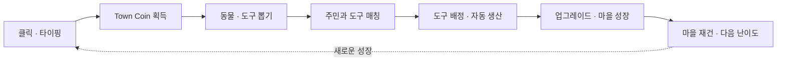
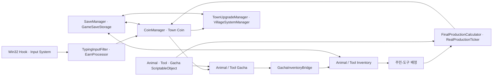

<div align="center">
  

  <h1>Task Town</h1>
  <h3>일하는 동안에도, 우리 마을은 자랍니다.</h3>

  <p>
    클릭과 타이핑을 마을의 성장으로 바꾸는<br />
    Windows 데스크톱 컴패니언 방치형 동물 마을 게임
  </p>

  <p>
    
    
    
    
  </p>
</div>

<p align="center">
  
</p>

## 01. What — 프로젝트 목적과 핵심 기능

### 게임 소개

**Task Town**은 평소의 컴퓨터 활동을 작은 보상으로 바꾸고, 수집한 주민과 도구의 조합으로 마을을 성장시키는 Windows 데스크톱 컴패니언 게임입니다.

플레이어는 조용해진 마을에 새로 부임한 촌장이 됩니다. 다른 작업을 하며 발생하는 유효한 마우스 클릭과 키보드 입력으로 `Town Coin`을 모으고, 동물 주민과 도구를 뽑아 서로 어울리는 조합을 만들어 주세요. 주민이 배정된 도구 조합은 시간에 따라 코인을 생산하며, 생산량과 마을 요소를 성장시켜 마을을 다시 활기차게 만드는 것이 목표입니다.

Task Town은 일상의 작업 흐름을 방해하기보다 **평소의 활동이 수집과 성장으로 이어지는 경험**을 지향합니다. 투명한 데스크톱 창과 축소 모드를 통해 작업 화면 곁에 마을을 두고, 필요할 때 자연스럽게 상호작용할 수 있습니다.

### 프로젝트 영상

| 공식 트레일러 | 게임플레이 |
| :---: | :---: |
| [](https://youtu.be/oigi4EJnz3I?si=SKkzENni1euZ98SK) | [](https://youtu.be/esm1oXyruGc?si=S-nXP1W843PxCfBQ) |
| [▶ 공식 트레일러 재생](https://youtu.be/oigi4EJnz3I?si=SKkzENni1euZ98SK) | [▶ 게임플레이 영상 재생](https://youtu.be/esm1oXyruGc?si=S-nXP1W843PxCfBQ) |

> GitHub README에서는 YouTube 영상이 페이지 안에서 자동 재생되지 않습니다. 위 썸네일을 선택하면 해당 YouTube 영상이 열립니다.

### 핵심 플레이 루프



### 주요 특징

#### 일상과 연결되는 데스크톱 컴패니언

- 게임 밖에서 발생한 유효한 클릭과 타이핑도 `Town Coin`으로 전환합니다.
- 항상 위에 표시되는 투명 창을 사용하며, 게임 요소가 없는 영역은 바탕화면으로 클릭이 통과합니다.
- 전체 마을을 살펴보는 확장 모드와 작업 중 곁에 둘 수 있는 축소 모드를 지원합니다.
- 과도한 연속 입력과 매크로성 입력은 필터링하여 정상적인 사용 흐름을 보상합니다.

#### 주민과 도구를 모으는 수집의 재미

- 서로 다른 등급과 해금 조건을 가진 **동물 주민 49종**, **도구 40종**을 수집할 수 있습니다.
- 동물과 도구는 각각 별도의 뽑기·인벤토리·도감·상세 정보 화면을 제공합니다.
- 중복 획득한 주민과 도구를 성장시키고, 난이도별 전용 주민을 발견할 수 있습니다.

#### 매칭과 배정으로 완성하는 자동 생산

- 한 도구에는 한 명의 주민을 배정할 수 있으며, **주민이 배정된 도구 조합**이 자동 생산에 참여합니다.
- 주민의 마을 배치는 생산 조건과 분리된 시각적 배치 상태로 관리됩니다.
- 주민과 도구의 능력, 레벨, 전용 매칭, 난이도와 도구 효율 업그레이드가 최종 생산량에 반영됩니다.
- 버스를 타고 새 주민이 도착하고, 마을을 돌아다니며 생활하는 연출을 제공합니다.

#### 성장하는 마을과 반복 플레이

- 클릭 보상, 타이핑 보상, 도구 효율의 세 가지 성장 트랙을 업그레이드할 수 있습니다.
- 마을은 `Lv.1`부터 `Lv.10`까지 성장하며, 배치 가능 주민 수가 **5명에서 최대 20명**으로 늘어납니다.
- 레벨에 따라 이용 가능한 주민·도구와 마을의 섬·건물 외형이 확장됩니다.
- 마을 재건을 완료한 뒤에는 현재 마을에 머물거나, 진행을 초기화하고 다음 난이도에 도전할 수 있습니다.

#### 튜토리얼과 저장

- 신사 오리 **모리스**가 말풍선과 강조 효과로 핵심 기능을 안내합니다.
- 코인, 인벤토리, 성장 단계, 해금 상태, 주민 배치, 난이도와 튜토리얼 진행도를 저장합니다.
- 게임 종료와 일시 정지 시 저장되며, 실행 중에는 주기적으로 자동 저장합니다.

### 콘텐츠 한눈에 보기

| 구분 | 내용 |
| --- | --- |
| 장르 | Desktop Companion · Building · Idle · Collection |
| 플랫폼 | Windows Standalone |
| 동물 주민 | 49종 |
| 도구 | 40종 |
| 마을 성장 | Lv.1 ~ Lv.10 |
| 주민 배치 | 5명 ~ 최대 20명 |
| 난이도 | Normal · Hard · VeryHard |
| 성장 트랙 | 클릭 보상 · 타이핑 보상 · 도구 효율 |
| 현재 버전 | 0.1.0 |

### 기본 조작

| 입력 | 동작 |
| --- | --- |
| 마우스 좌·우 클릭 | 게임 실행 중 Town Coin 획득 |
| 키보드 입력 | 유효한 키 입력마다 Town Coin 획득 |
| UI 좌클릭 | 뽑기, 인벤토리, 도감, 배치, 업그레이드 등 메뉴 이용 |
| 마을 좌클릭 드래그 | 확장 화면에서 마을 위치 이동 |
| 동물 주민 좌클릭 | 주민 확대 및 카메라 추적 |
| 빈 공간 또는 포커스 해제 | 주민 카메라 추적 종료 |
| 축소 / 확장 버튼 | 작은 데스크톱 모드와 전체 마을 화면 전환 |

## 02. Run — 버전·설치·실행

### 실행 환경

| 항목 | 기준 |
| --- | --- |
| Project Version | `0.1.0` |
| Unity | `6000.3.15f1` |
| Render Pipeline | Universal Render Pipeline `17.3.0` |
| Input | Unity Input System `1.19.0` + Windows Win32 Hook |
| Navigation | AI Navigation `2.0.13` |
| Test Framework | Unity Test Framework `1.6.0` |
| Target | Windows 10/11 · Standalone |

### 소스에서 실행

준비물은 Unity Hub, Unity Editor `6000.3.15f1`, Git과 Git LFS입니다.

```bash
git lfs install
git clone https://github.com/sudeang0-hue/NookDuck_TaskTown.git
cd NookDuck_TaskTown
git lfs pull
```

1. Unity Hub에서 클론한 프로젝트를 엽니다.
2. [`00.BootstrapScene.unity`](./Assets/00.Project/00.Scenes/Project_Scene/00.BootstrapScene.unity)를 엽니다.
3. Play를 눌러 `Bootstrap → Team Logo → Title Loading → Main` 흐름을 확인합니다.

> [!IMPORTANT]
> `03.MainScene`부터 직접 실행하면 전역 매니저와 시작 로딩 흐름 일부를 건너뛸 수 있습니다. 전체 재현은 반드시 `00.BootstrapScene`에서 시작합니다.

### Windows 빌드 실행

| 배포 파일 | 링크 |
| --- | --- |
| 최신 Windows ZIP | **( Windows Build )** |

GitHub Releases에 빌드가 등록되기 전에는 다음 절차로 직접 생성합니다.

1. Unity의 Build Profiles에서 Windows를 선택합니다.
2. Build Settings에 등록된 운영 Scene 순서를 유지합니다.
3. Windows Standalone 빌드를 생성하고 `TaskTown.exe`를 실행합니다.
4. 다른 색상의 창을 게임 뒤에 두고 투명도와 빈 영역 클릭 투과를 확인합니다.

> [!IMPORTANT]
> 전역 키보드·마우스 입력, 투명 창, 테두리 제거와 빈 영역 클릭 투과는 **Unity Editor가 아닌 Windows 실행 빌드**에서 최종 확인해야 합니다.

## 03. Structure — 폴더·시스템·데이터 흐름

### 기술 구현

| 영역 | 구현 내용 |
| --- | --- |
| 전역 입력 | Win32 Low-Level Keyboard/Mouse Hook의 입력을 큐에 수집한 뒤 Unity 메인 스레드에서 이벤트로 전달 |
| 투명 창 | Windows DWM과 Win32 Window Style을 이용한 투명·테두리 없음·Always on Top·빈 영역 클릭 투과 |
| 생산 시스템 | 주민·도구 레벨, 전용 매칭, 난이도, 도구 효율을 조합한 데이터 기반 생산량 계산 |
| 콘텐츠 데이터 | 동물, 도구, 뽑기 풀과 튜토리얼 설정을 `ScriptableObject`로 분리 |
| Scene Flow | Bootstrap에서 전역 시스템을 준비하고 Team Logo, Title Loading, Main Scene으로 이어지는 로딩 파이프라인 구성 |
| 저장 시스템 | `JsonUtility` 기반 단일 JSON 저장과 `PlayerPrefs` 보조 메타데이터 사용 |
| 주민 이동 | Unity AI Navigation을 활용한 주민 배치와 마을 이동 |
| UI 연출 | uGUI, TextMesh Pro와 DOTween 기반 화면 전환·뽑기·튜토리얼 피드백 |

### 시스템 데이터 흐름



- 전역 입력은 필터를 거쳐 `Town Coin`으로 변환됩니다.
- 뽑기 결과는 브리지를 통해 동물·도구 인벤토리에 반영됩니다.
- 주민이 배정된 도구 슬롯을 생산 시스템이 계산하고, 결과를 다시 재화 시스템에 지급합니다.
- `ScriptableObject`는 고정 설정을, Manager와 SlotData는 실행 중 상태를 담당합니다.
- `SaveManager`는 재화, 인벤토리, 성장과 마을 진행 상태를 JSON으로 저장하고 복원합니다.

### Scene Flow

```text
00.BootstrapScene
  └─ 01.TeamLogoScene
       └─ 02.TitleLoadingScene
            └─ 03.MainScene
                 ├─ tutorial_Overlay
                 └─ 04.DifficultySelectScene (마을 재건 이후)
```

- `BootstrapScene`에서 전역 매니저와 설정을 초기화합니다.
- `TitleLoadingScene`에서 시작 검증과 Main Scene 사전 로드를 수행합니다.
- 최초 플레이 시 Main Scene 위에 튜토리얼 Overlay를 추가로 로드합니다.
- 마을 재건 후 새 회차를 선택하면 난이도 선택 Scene으로 이동합니다.

### 프로젝트 구조

```text
Assets/00.Project/
├─ 00.Scenes/
│  ├─ Project_Scene/          # 실제 빌드 Scene
│  └─ Test_Scenes/            # 기능별 수동 검증 Scene
├─ 01.Scripts/                # Runtime C# 코드
│  ├─ Core/                   # 재화 획득 등 핵심 흐름
│  ├─ Gacha/                  # 뽑기·등급·생산량 계산
│  ├─ SceneFlow/              # 시작·로딩·Scene 전환
│  ├─ System/                 # 저장·인벤토리·배치·Windows 연동
│  ├─ Tutorial/               # 튜토리얼 진행
│  └─ UI/                     # 사용자 인터페이스
├─ 02.Prefabs/                # 게임 오브젝트와 UI Prefab
├─ 03.ScriptableObjects/      # 동물·도구·뽑기·튜토리얼 데이터
├─ 06.UI/                     # UI 이미지와 폰트 자산
├─ 07.Audio/                  # BGM·SFX 및 사운드 데이터
├─ 10.Image/                  # 타이틀·튜토리얼·프로모션 이미지
└─ Editor/Tests/              # 저장·튜토리얼 등 EditMode 테스트
```

### 핵심 코드

| 시스템 | 주요 파일 |
| --- | --- |
| 입력과 재화 획득 | [`EarnProcessor.cs`](./Assets/00.Project/01.Scripts/Core/EarnProcessor.cs), [`GlobalKeyboardHook.cs`](./Assets/00.Project/01.Scripts/System/NB/TestSystem/Window_InputSystem/GlobalKeyboardHook.cs) |
| 투명 데스크톱 창 | [`TransparentWindow.cs`](./Assets/00.Project/01.Scripts/System/NB/TransparentWindow.cs) |
| 뽑기와 인벤토리 연결 | [`GachaInventoryBridge.cs`](./Assets/00.Project/01.Scripts/System/Inventory/GachaInventoryBridge.cs) |
| 생산량 계산과 지급 | [`FinalProductionCalculator.cs`](./Assets/00.Project/01.Scripts/Gacha/FinalProductionCalculator.cs), [`RealProductionTicker.cs`](./Assets/00.Project/01.Scripts/System/Inventory/RealProductionTicker.cs) |
| 마을 성장 | [`VillageSystemManager.cs`](./Assets/00.Project/01.Scripts/Managers/VillageSystemManager.cs) |
| 저장과 복원 | [`SaveManager.cs`](./Assets/00.Project/01.Scripts/System/Save/SaveManager.cs) |
| 시작 로딩 파이프라인 | [`StartupLoadPipeline.cs`](./Assets/00.Project/01.Scripts/SceneFlow/Runtime/StartupLoading/StartupLoadPipeline.cs) |

## 04. Verify — 측정 장면·테스트 방법

검증 결과를 추정해서 기록하지 않습니다. 실행하지 않은 항목은 `Not Checked`로 남기고, 실행 날짜·환경·결과 파일을 함께 갱신합니다.

### 자동 테스트

1. Unity에서 `Window > General > Test Runner`를 엽니다.
2. `EditMode` 탭에서 `Run All`을 실행합니다.
3. 테스트 대상은 [`Assets/00.Project/Editor/Tests`](./Assets/00.Project/Editor/Tests)와 [`Assets/00.Project/01.Scripts/Gacha/Tests`](./Assets/00.Project/01.Scripts/Gacha/Tests)에 있습니다.
4. 실행 결과와 Unity Editor 로그를 보관합니다.

배치 실행 예시:

```powershell
& "{UNITY_EDITOR_PATH}\Unity.exe" -batchmode -projectPath "." -runTests -testPlatform EditMode -testResults "TestResults\editmode-results.xml" -logFile "TestResults\editmode.log" -quit
```

| 실행일 | Unity | 대상 | 통과 | 실패 | 결과 파일 |
| --- | --- | --- | ---: | ---: | --- |
| Not Checked | 6000.3.15f1 | EditMode | Not Checked | Not Checked | 미생성 |

### 수동 E2E 테스트

| 장면 / 환경 | 확인 방법 | 합격 기준 | 결과 |
| --- | --- | --- | --- |
| `00.BootstrapScene` | Bootstrap부터 Main까지 실행 | 운영 Scene 전환 완료, Console Error 0 | Not Checked |
| `03.MainScene` | 클릭·타이핑 후 동물·도구 뽑기와 배정 | 코인·인벤토리·생산량이 의도대로 갱신 | Not Checked |
| Windows Standalone | 다른 프로그램을 사용하며 입력, 축소·확장, 빈 영역 클릭 | 입력 보상과 자동 생산 누적, 투명 영역 클릭 투과 | Not Checked |
| 저장 후 재실행 | 코인·인벤토리·성장·배치 상태 비교 | 저장 직전 상태 복원 | Not Checked |
| 마을 재건 이후 | 현재 마을 유지 또는 다음 회차 선택 | 선택 결과와 난이도가 다음 흐름에 반영 | Not Checked |

기능별 수동 검증 Scene은 [`Assets/00.Project/00.Scenes/Test_Scenes`](./Assets/00.Project/00.Scenes/Test_Scenes)에 있으며, 운영 흐름의 최종 확인은 `00.BootstrapScene`에서 수행합니다.

### 성능 측정

- **Scene:** `03.MainScene`
- **Build:** Windows Standalone Development Build
- **조건:** 확장 화면, 해금된 최대 주민 수 배치, 1920 × 1080
- **측정 시간:** 60초
- **도구:** Unity Profiler
- **기록 항목:** 평균 FPS, 1% Low FPS, Main Thread, GC Alloc/frame, 메모리

| 실행일 | CPU / GPU / RAM | 평균 FPS | 1% Low | Main Thread | GC Alloc/frame | 메모리 |
| --- | --- | ---: | ---: | ---: | ---: | ---: |
| Not Checked | Not Checked | Not Checked | Not Checked | Not Checked | Not Checked | Not Checked |

## 05. Evidence — Build · Video · Capture

### 실행 증빙 현황

| 항목 | 위치 | 기준 버전 | 상태 |
| --- | --- | --- | --- |
| Windows Build | 상단 `Windows 빌드 실행` 영역 | 0.1.0 | GitHub Release 업로드 후 링크 갱신 |
| Trailer | [공식 트레일러](https://youtu.be/oigi4EJnz3I?si=SKkzENni1euZ98SK) | 0.1.0 | 연결 완료 |
| Gameplay Video | [게임플레이 영상](https://youtu.be/esm1oXyruGc?si=S-nXP1W843PxCfBQ) | 0.1.0 | 연결 완료 |
| Gameplay Capture | 아래 캡처 영역 | 0.1.0 | 실제 Windows 빌드 화면 촬영 필요 |
| Project Version | [`ProjectSettings.asset`](./ProjectSettings/ProjectSettings.asset), [`ProjectVersion.txt`](./ProjectSettings/ProjectVersion.txt) | 저장소 현재 상태 | 확인 가능 |
| Build Scene | [`EditorBuildSettings.asset`](./ProjectSettings/EditorBuildSettings.asset) | 저장소 현재 상태 | 확인 가능 |
| Automated Test Source | [`Editor/Tests`](./Assets/00.Project/Editor/Tests), [`Gacha/Tests`](./Assets/00.Project/01.Scripts/Gacha/Tests) | 저장소 현재 상태 | 결과 실행 전 |

> [!NOTE]
> 로컬 `Builds/` 폴더는 Git 추적 대상이 아니며 현재 소스의 배포 증빙으로 사용할 수 없습니다. 동일한 commit에서 새 빌드를 만들고 GitHub Release에 ZIP과 해시를 게시한 뒤 위 링크를 갱신합니다.

### 게임 화면 캡처

| 확장 마을 화면 | 축소 데스크톱 모드 |
| :---: | :---: |
| **( 게임 화면 캡처 )** | **( 게임 화면 캡처 )** |

| 동물·도구 뽑기와 배정 | 마을 재건·난이도 선택 |
| :---: | :---: |
| **( 게임 화면 캡처 )** | **( 게임 화면 캡처 )** |

모든 실행 증빙에는 다음 정보를 함께 기록합니다.

- 게임 버전 또는 Git tag
- commit SHA
- 빌드 날짜
- Windows 버전과 핵심 하드웨어
- 촬영 또는 테스트한 Scene

## 06. Limits — 알려진 문제·다음 개선

### 현재 제한과 검증 필요 항목

| 항목 | 영향 | 확인 / 우회 방법 |
| --- | --- | --- |
| 전역 입력·투명 창·클릭 투과는 Windows Standalone 전용 | Editor와 다른 OS에서는 실제 동작을 재현할 수 없음 | Windows 실행 빌드에서 최종 확인 |
| Win32 Hook과 Input System 보조 입력 경로가 함께 사용됨 | 게임 창에 포커스된 입력의 중복 보상 여부를 추가 검증해야 함 | Windows 빌드에서 입력 1회당 재화 변화량을 회귀 테스트 |
| 과도한 연속 입력과 매크로성 입력은 필터링됨 | 입력 횟수와 획득 코인이 항상 일치하지 않을 수 있음 | 정상적인 입력 속도로 기능 확인 |
| 기존 저장 데이터가 튜토리얼과 해금 상태에 영향을 줌 | 최초 플레이 흐름이 바로 나타나지 않을 수 있음 | 설정에서 초기화하거나 튜토리얼 다시 보기 사용 |
| 오프라인 보상 계산 코드의 활성 Scene 연결이 확인되지 않음 | 현재 빌드의 핵심 제공 기능으로 보장하지 않음 | 런타임 연결과 통합 테스트 완료 후 기능 목록에 반영 |
| 자동 테스트·Profiler 결과가 아직 문서화되지 않음 | 통과율과 성능 수치를 재현할 증빙이 없음 | `Verify` 절차 실행 후 결과 파일과 측정값 기록 |
| Release·실제 캡처 링크가 아직 README에 연결되지 않음 | 저장소 방문자가 빌드와 세부 화면을 바로 확인할 수 없음 | 준비된 파일과 URL을 `Evidence` 영역에 연결 |

### 다음 개선

- 전역 입력 경로 단일화와 중복 보상 회귀 테스트
- 오프라인 보상 런타임 연결, 서버 시간 검증과 밸런스 확인
- 미니게임과 치장 아이템 추가
- Windows DPI, 다중 모니터와 입력 Hook 호환성 테스트 확대
- EditMode 테스트 CI, Windows 통합 테스트와 성능 측정 자동화
- 버전 tag, Release ZIP, 해시, 영상과 캡처를 묶는 배포 증빙 절차 정리

## Team Nookduck

**OZ코딩스쿨 5기 · Team Nookduck**

| 이름 | 역할 | 담당 |
| --- | --- | --- |
| 최희수 | 팀장 · 리드 기획 · 개발 총괄 | 프로젝트 기획, 공통 프레임워크, 사운드, 기능 통합, Git·QA·빌드 관리 |
| 김도현 | 코어 게임플레이 개발 | 전역 입력, 핵심 플레이 루프, 게임 진행, 엔딩·리셋·난이도 전환 |
| 정나범 | UX·비주얼 및 콘텐츠 개발 | 메인 UI, 마을 모델링, 동물 연출, 오브젝트 배치 콘텐츠 |
| 김남우 | 성장·경제 시스템 개발 | 동물·도구 성장, 뽑기, 생산량, 특화 보너스, 난이도·경제 밸런스 |
| 김아영 | UI·데이터 및 프레젠테이션 | 재화·도감·배치·난이도 UI, 데이터 연결, 발표 자료, 사용자 안내 |

---

<div align="center">
  <strong>Animal Village · Building &amp; Idle Game</strong><br />
  <sub>© 2026 Nook Duck. All rights reserved.</sub>
</div>
